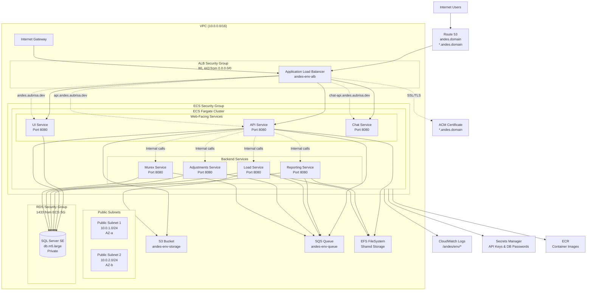

## Andes AWS Deployment Guide



### Resource Inventory

| Resource | Name | Description |
| --- | --- | --- |
| VPC | `andes-[env]-vpc` | App VPC with DNS support/hostnames (10.0.0.0/16) |
| Public Subnets | `andes-[env]-public-subnet-1/2` | AZ a/b, map public IP on launch (10.0.1.0/24, 10.0.2.0/24) |
| Internet Gateway | `andes-[env]-igw` | IGW attach + 0.0.0.0/0 route |
| Route Table | `andes-[env]-public-rt` | Public route table with IGW route |
| Security Groups | `andes-[env]-alb-sg`<br/>`andes-[env]-ecs-sg`<br/>`andes-[env]-rds-sg`<br/>`andes-[env]-efs-sg` | ALB: 80/443 from 0.0.0.0/0<br/>ECS: 8080 from ALB SG<br/>RDS: 1433 from ECS SG<br/>EFS: 2049 from ECS SG |
| Application Load Balancer | `andes-[env]-alb` | Internet-facing across both public subnets |
| ALB Listeners | AWS-managed | HTTP:80 redirect → HTTPS:443 |
| Target Groups | `andes-[env]-api-tg`<br/>`andes-[env]-chat-tg`<br/>`andes-[env]-ui-tg` | All @8080, IP target type, host-based health checks |
| Listener Rules | AWS-managed | Host-based routing (api.andes.[domain], chat-api.andes.[domain]; default ui) |
| ACM Certificate | AWS-managed | DNS-validated wildcard cert for *.andes.[domain] + andes.[domain] |
| Route 53 Records | `andes.[domain]`<br/>`*.andes.[domain]` | A/AAAA alias to ALB |
| ECS Cluster | `andes-[env]` | Fargate cluster |
| ECS Services | `andes-[env]-ui`<br/>`andes-[env]-api`<br/>`andes-[env]-chat`<br/>`andes-[env]-reporting`<br/>`andes-[env]-load`<br/>`andes-[env]-adjustments`<br/>`andes-[env]-murex` | Web-facing (ui/api/chat) + backend services |
| Task Definitions | `andes-ui`<br/>`andes-api`<br/>`andes-chat`<br/>`andes-reporting`<br/>`andes-load`<br/>`andes-adjustments`<br/>`andes-murex` | One per service; env/secrets/logging; all @8080 |
| S3 Bucket | `andes-[env]-storage` | S3 Standard, private |
| SQS Queue | `andes-[env]-queue` | 14-day retention, Standard queue |
| EFS FileSystem | `andes-[env]-efs` | Shared storage for API/Load/Reporting services |
| CloudWatch Log Groups | `/andes/[env]/api`<br/>`/andes/[env]/chat`<br/>`/andes/[env]/ui`<br/>`/andes/[env]/report`<br/>`/andes/[env]/load`<br/>`/andes/[env]/adjustments`<br/>`/andes/[env]/murex` | 7-day retention (configurable) |
| RDS Instance | `andes-[env]-sql` | SQL Server SE, db.m5.large, gp3 100GB, 7-day backups |
| RDS Subnet Group | `andes-[env]-rds-subnet-group` | Uses both public subnets (SG-restricted) |
| Secrets Manager | `andes/[env]/entraid-api-key`<br/>`andes/[env]/chat-api-key`<br/>`andes/[env]/ai-api-key`<br/>`andes/[env]/rds-password` | API keys (placeholders) + generated DB password |
| IAM Roles | `andes-[env]-task-execution-role`<br/>`andes-[env]-*-task-role` | Execution role + per-service task roles with specific permissions |
| Hosted Zone | Existing | Pre-existing Route 53 zone for domain |

### Prerequisites

- AWS CLI configured with permissions for CloudFormation, S3, ECS, RDS, IAM, Route 53, ACM, and Secrets Manager.
- A private ECR (Elastic Container Registry).
- A public hosted zone in Route 53 containing `DomainName`.
- PowerShell (scripts use backticks for line continuation).

## Prerequisites

1. **AWS Account** with administrative access
2. **Domain name** with Route 53 hosted zone
3. **Container images** pushed to your ECR repository
4. **S3 Bucket** for CloudFormation package

## Step 1: Copy Container Images

Aubrisa will provide you with read access to their ECR repository<code class="copyable">AUBRISA-ACCOUNT-ID.dkr.ecr.REGION.amazonaws.com</code>

Copy the images to your ECR:

Bash:

```bash
# Login to both ECR repositories
aws ecr get-login-password --region REGION | \
  docker login --username AWS --password-stdin \
  AUBRISA-ACCOUNT-ID.dkr.ecr.REGION.amazonaws.com

aws ecr get-login-password --region YOUR-REGION | \
  docker login --username AWS --password-stdin \
  YOUR-ACCOUNT.dkr.ecr.YOUR-REGION.amazonaws.com

# Create repositories in your ECR
aws ecr create-repository --repository-name aubrisa/andes-api
aws ecr create-repository --repository-name aubrisa/andes-ui
aws ecr create-repository --repository-name aubrisa/andes-chat
aws ecr create-repository --repository-name aubrisa/andes-reporting
aws ecr create-repository --repository-name aubrisa/andes-load
aws ecr create-repository --repository-name aubrisa/andes-adjustment-service
aws ecr create-repository --repository-name aubrisa/andes-murex

# Pull and push images
docker pull \
  AUBRISA-ACCOUNT-ID.dkr.ecr.REGION.amazonaws.com/aubrisa/andes-api:latest

docker tag \
  AUBRISA-ACCOUNT-ID.dkr.ecr.REGION.amazonaws.com/aubrisa/andes-api:latest \
  YOUR-ACCOUNT.dkr.ecr.YOUR-REGION.amazonaws.com/aubrisa/andes-api:latest

docker push \
  YOUR-ACCOUNT.dkr.ecr.YOUR-REGION.amazonaws.com/aubrisa/andes-api:latest

# Repeat for all services: ui, chat, reporting, load, adjustment-service, murex
```

PowerShell:

```powershell
# Login to both ECR repositories
aws ecr get-login-password --region REGION | `
  docker login --username AWS --password-stdin `
  AUBRISA-ACCOUNT-ID.dkr.ecr.REGION.amazonaws.com

aws ecr get-login-password --region YOUR-REGION | `
  docker login --username AWS --password-stdin `
  YOUR-ACCOUNT.dkr.ecr.YOUR-REGION.amazonaws.com

# Create repositories in your ECR
aws ecr create-repository --repository-name aubrisa/andes-api
aws ecr create-repository --repository-name aubrisa/andes-ui
aws ecr create-repository --repository-name aubrisa/andes-chat
aws ecr create-repository --repository-name aubrisa/andes-reporting
aws ecr create-repository --repository-name aubrisa/andes-load
aws ecr create-repository --repository-name aubrisa/andes-adjustment-service
aws ecr create-repository --repository-name aubrisa/andes-murex

# Pull and push images
docker pull `
  AUBRISA-ACCOUNT-ID.dkr.ecr.REGION.amazonaws.com/aubrisa/andes-api:latest

docker tag `
  AUBRISA-ACCOUNT-ID.dkr.ecr.REGION.amazonaws.com/aubrisa/andes-api:latest `
  YOUR-ACCOUNT.dkr.ecr.YOUR-REGION.amazonaws.com/aubrisa/andes-api:latest

docker push `
  YOUR-ACCOUNT.dkr.ecr.YOUR-REGION.amazonaws.com/aubrisa/andes-api:latest

# Repeat for all services: ui, chat, reporting, load, adjustment-service, murex
```

## Step 2: Create Parameter File

Copy `app-template.json` to `app-[enviroment].json` and update:

```json
[
  {
    "ParameterKey": "AppName",
    "ParameterValue": "andes"
  },
  {
    "ParameterKey": "EnvironmentName",
    "ParameterValue": "[environment]"
  },
  {
    "ParameterKey": "AndesVersion",
    "ParameterValue": "latest"
  },
  {
    "ParameterKey": "EcrRepositoryUri",
    "ParameterValue": "YOUR-ACCOUNT.dkr.ecr.YOUR-REGION.amazonaws.com"
  },
  {
    "ParameterKey": "DomainName",
    "ParameterValue": "your-domain.com"
  },
  {
    "ParameterKey": "HostedZoneId",
    "ParameterValue": "ROUTE_53_ZONE_ID"
  },
  {
    "ParameterKey": "TenantId",
    "ParameterValue": "ENTRA_TENANT_ID"
  },
  {
    "ParameterKey": "ClientId",
    "ParameterValue": "ENTRA_CLIENT_ID"
  },
  {
    "ParameterKey": "AiEndpoint",
    "ParameterValue": "AI_API_ENDPOINT"
  },
  {
    "ParameterKey": "AdminCidr",
    "ParameterValue": "YOUR_IP (For database admin connection)/32"
  }
]
```

## Step 3: Deploy Infrastructure

Bash:

```bash

StackName="andes-app-[env]"

# Package templates
aws cloudformation package \
  --template-file cloudFormation/templates/app.yaml \
  --s3-bucket YOUR-ARTIFACTS-BUCKET \
  --output-template-file app-packaged.yaml

# Load parameters from file
params=$(jq -r '.[] | "\(.ParameterKey)=\(.ParameterValue)"' \
    cloudFormation/params/app-[env].json)

aws cloudformation deploy \
  --stack-name $StackName \
  --template-file cloudFormation/templates/app-packaged.yaml \
  --parameter-overrides $params \
  --capabilities CAPABILITY_NAMED_IAM \
  --tags project=andes env=dev \
  --region REGION

# Deploy stack
aws cloudformation deploy \
  --stack-name andes-app-[env] \
  --template-file app-packaged.yaml \
  --parameter-overrides file://app-[env].json \
  --capabilities CAPABILITY_NAMED_IAM
```

PowerShell:

```powershell
$StackName="andes-app-[env]"

# Package templates
aws cloudformation package `
  --template-file cloudFormation/templates/app.yaml `
  --s3-bucket YOUR-ARTIFACTS-BUCKET `
  --output-template-file app-packaged.yaml

# Load parameters from file
$params = Get-Content cloudFormation/params/app-[env].json | ConvertFrom-Json | `
    ForEach-Object { "$( $_.ParameterKey )=$( $_.ParameterValue )" }

# Deploy stack
aws cloudformation deploy `
   --stack-name $StackName `
   --template-file cloudFormation/templates/app-packaged.yaml `
   --parameter-overrides $params `
   --capabilities CAPABILITY_NAMED_IAM `
   --tags project=andes env=dev `
   --region REGION
```

## Step 4: Configure Secrets

Bash:

```bash
# Set API keys
aws secretsmanager update-secret \
  --secret-id andes/[env]/entraid-api-key \
  --secret-string '{"key": "ENTRA_KEY"}'

aws secretsmanager update-secret \
  --secret-id andes/[env]/chat-api-key \
  --secret-string '{"key": "CHAT_KEY"}'

aws secretsmanager update-secret \
  --secret-id andes/[env]/ai-api-key \
  --secret-string '{"key": "AI_KEY"}'
```

PowerShell:

```powershell
# Set API keys
aws secretsmanager update-secret `
  --secret-id andes/[env]/entraid-api-key `
  --secret-string '{"key": "ENTRA_KEY"}'

aws secretsmanager update-secret `
  --secret-id andes/[env]/chat-api-key `
  --secret-string '{"key": "CHAT_KEY"}'

aws secretsmanager update-secret `
  --secret-id andes/[env]/ai-api-key `
  --secret-string '{"key": "AI_KEY"}'
```

## Image Updates

When Aubrisa releases new versions, copy the new images:

```bash
# Pull new version from Aubrisa ECR
docker pull \
  AUBRISA-ACCOUNT-ID.dkr.ecr.REGION.amazonaws.com/aubrisa/andes-api:v1.2.3

# Tag and push to your ECR
docker tag \
  AUBRISA-ACCOUNT-ID.dkr.ecr.REGION.amazonaws.com/aubrisa/andes-api:v1.2.3 \
  YOUR-ACCOUNT.dkr.ecr.YOUR-REGION.amazonaws.com/aubrisa/andes-api:v1.2.3

docker push \
  YOUR-ACCOUNT.dkr.ecr.YOUR-REGION.amazonaws.com/aubrisa/andes-api:v1.2.3

# Update ImageTag parameter and redeploy
aws cloudformation deploy \
  --stack-name andes-app-[env] \
  --template-file app-packaged.yaml \
  --parameter-overrides file://app-[env].json ImageTag=v1.2.3 \
  --capabilities CAPABILITY_NAMED_IAM
```

## Monitoring

- **Application URL**: `https://your-domain.com`
- **CloudWatch Logs**: `/andes/[env]/[service]`
- **RDS Endpoint**: Check stack outputs
