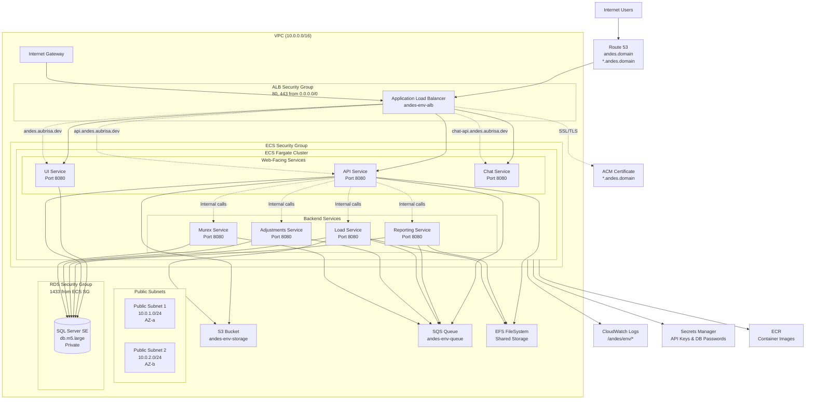

## Andes AWS Deployment Guide



### Resource Inventory

| Resource | Name | Description |
| --- | --- | --- |
| VPC | `andes-[env]-vpc` | App VPC with DNS support/hostnames (10.0.0.0/16) |
| Public Subnets | `andes-[env]-public-subnet-1/2` | AZ a/b, map public IP on launch (10.0.1.0/24, 10.0.2.0/24) |
| Internet Gateway | `andes-[env]-igw` | IGW attach + 0.0.0.0/0 route |
| Route Table | `andes-[env]-public-rt` | Public route table with IGW route |
| Security Groups | `andes-[env]-alb-sg`<br/>`andes-[env]-ecs-sg`<br/>`andes-[env]-rds-sg`<br/>`andes-[env]-efs-sg` | ALB: 80/443 from 0.0.0.0/0<br/>ECS: 8080 from ALB SG<br/>RDS: 1433 from ECS SG<br/>EFS: 2049 from ECS SG |
| Application Load Balancer | `andes-[env]-alb` | Internet-facing across both public subnets |
| ALB Listeners | AWS-managed | HTTP:80 redirect → HTTPS:443 |
| Target Groups | `andes-[env]-api-tg`<br/>`andes-[env]-chat-tg`<br/>`andes-[env]-ui-tg` | All @8080, IP target type, host-based health checks |
| Listener Rules | AWS-managed | Host-based routing (api.andes.[domain], chat-api.andes.[domain]; default ui) |
| ACM Certificate | AWS-managed | DNS-validated wildcard cert for *.andes.[domain] + andes.[domain] |
| Route 53 Records | `andes.[domain]`<br/>`*.andes.[domain]` | A/AAAA alias to ALB |
| ECS Cluster | `andes-[env]` | Fargate cluster |
| ECS Services | `andes-[env]-ui`<br/>`andes-[env]-api`<br/>`andes-[env]-chat`<br/>`andes-[env]-reporting`<br/>`andes-[env]-load`<br/>`andes-[env]-adjustments`<br/>`andes-[env]-murex` | Web-facing (ui/api/chat) + backend services |
| Task Definitions | `andes-ui`<br/>`andes-api`<br/>`andes-chat`<br/>`andes-reporting`<br/>`andes-load`<br/>`andes-adjustments`<br/>`andes-murex` | One per service; env/secrets/logging; all @8080 |
| S3 Bucket | `andes-[env]-storage` | S3 Standard, private |
| SQS Queue | `andes-[env]-queue` | 14-day retention, Standard queue |
| EFS FileSystem | `andes-[env]-efs` | Shared storage for API/Load/Reporting services |
| CloudWatch Log Groups | `/andes/[env]/api`<br/>`/andes/[env]/chat`<br/>`/andes/[env]/ui`<br/>`/andes/[env]/report`<br/>`/andes/[env]/load`<br/>`/andes/[env]/adjustments`<br/>`/andes/[env]/murex` | 7-day retention (configurable) |
| RDS Instance | `andes-[env]-sql` | SQL Server SE, db.m5.large, gp3 100GB, 7-day backups |
| RDS Subnet Group | `andes-[env]-rds-subnet-group` | Uses both public subnets (SG-restricted) |
| Secrets Manager | `andes/[env]/entraid-api-key`<br/>`andes/[env]/chat-api-key`<br/>`andes/[env]/ai-api-key`<br/>`andes/[env]/rds-password` | API keys (placeholders) + generated DB password |
| IAM Roles | `andes-[env]-task-execution-role`<br/>`andes-[env]-*-task-role` | Execution role + per-service task roles with specific permissions |
| Hosted Zone | Existing | Pre-existing Route 53 zone for domain |

### Prerequisites

- AWS CLI configured with permissions for CloudFormation, S3, ECS, RDS, IAM, Route 53, ACM, and Secrets Manager.
- A private ECR or GHCR image registry secret ARN (`RegistryAuthSecretArn`).
- A public hosted zone in Route 53 containing `DomainName`.
- PowerShell (scripts use backticks for line continuation).

### Workflow

Add GHR credentials:

```
aws secretsmanager create-secret --name "andes/github-container-registry-auth" --description "GitHub Container Registry authentication for Andes application" --secret-string '{
  "auths": {
    "ghcr.io": {
      "username": "your-github-username", 
      "password": "your-github-token"
    }
  }
}'
```

1) **Create/prepare the artifacts bucket** (once per region):
```
$Bucket = "andes-cfn-templates-eu-west-2"
aws s3api create-bucket `
  --bucket $Bucket `
  --region eu-west-2 `
  --create-bucket-configuration LocationConstraint=eu-west-2

aws s3api put-bucket-versioning `
  --bucket $Bucket `
  --versioning-configuration Status=Enabled
```

2) **Validate the root template** (optional but recommended):
```
aws cloudformation validate-template `
  --template-body file://cloudFormation/templates/app.yaml
```

3) **Package nested templates** (uploads artifacts to S3 and rewrites URLs):
```
$Bucket = "andes-cfn-templates-eu-west-2"
aws cloudformation package `
  --template-file cloudFormation/templates/app.yaml `
  --s3-bucket $Bucket `
  --s3-prefix nested `
  --output-template-file cloudFormation/templates/app-packaged.yaml `
  --region eu-west-2
```

4) **Deploy** (parameters read from JSON):
```
$StackName = "andes-app-dev"
$params = Get-Content cloudFormation/params/app-dev.json | ConvertFrom-Json |
  ForEach-Object { "$( $_.ParameterKey )=$( $_.ParameterValue )" }

$SecretArn = aws secretsmanager describe-secret --secret-id "andes/github-container-registry-auth" --query ARN --output text

aws cloudformation deploy `
  --stack-name $StackName `
  --template-file cloudFormation/templates/app-packaged.yaml `
  --parameter-overrides $params `
  --capabilities CAPABILITY_NAMED_IAM `
  --tags project=andes env=dev `
  --region eu-west-2
```

5) **Set rotating secrets (post-deploy convenience script):**
```
.\scripts\set-secrets.ps1 -AppName "andes" `
  -EnvironmentName "dev" `
  -EntraApiKey "your-entra-key" `
  -ChatApiKey "your-chat-key" `
  -AiApiKey "your-ai-key"
```

6) **Remove the stack** (irreversible; also deletes nested stacks):
```
$StackName = "andes-app-dev"
aws cloudformation delete-stack --stack-name $StackName --region eu-west-2
aws cloudformation wait stack-delete-complete --stack-name $StackName --region eu-west-2
```

### Estimate cost
```

```

### What Each Stack Delivers

- **Network**: VPC, two public subnets, public route table, IGW, security groups for ALB, ECS, RDS.
- **Storage**: App-scoped S3 bucket, SQS queue, log groups per service (api/chat/ui/report/load/adjustments/murex).
- **IAM**: Execution and task roles, registry pull permissions, S3/SQS access for tasks.
- **RDS**: SQL Server SE in multi-AZ disabled, password in Secrets Manager, private subnets, SG locked to ECS only.
- **ALB**: Internet-facing, HTTP→HTTPS redirect, ACM cert via DNS, path rules for api/chat/ui/reports/load/adjustments/murex, Route 53 A/AAAA aliases.
- **ECS TaskDefs**: One per service; injects secrets (Entra/chat/AI keys), AI endpoint/model IDs, S3/SQS/Log groups, and LoadBalancer DNS where needed.
- **ECS Services**: Cluster plus one service per task, wired to target groups, DesiredCount from parameter.

### Operational Notes

- Secrets Manager entries created by the root stack are placeholders; rotate them with `set-secrets.ps1` or manually via AWS console/API.
- Ensure the registry secret ARN has `.dockerconfigjson` for GHCR/ECR; task execution role must read it.
- Logs are in CloudWatch under `/andes/<env>/<service>`; health checks hit `/health/live` (api/chat/load/adjustments/murex) and `/` (ui/reporting).
- RDS is non-public; only ECS SG can reach port 1433. Backups retain 7 days by default.
- ALB enforces HTTPS; HTTP is redirected. DNS validation for ACM requires control of the hosted zone.